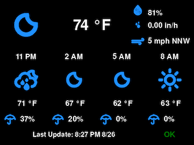
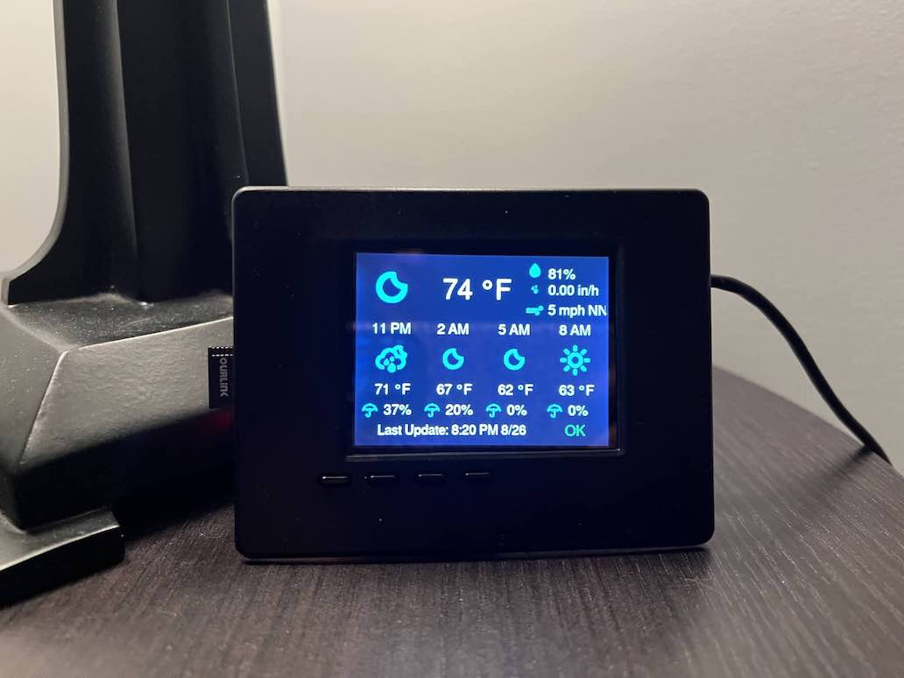

Weather Display for Raspberry Pi
--------------------------------

This program was designed to display weather data on a small display. I'm currently running this for on
an old Raspberry Pi model B with a [2.8" capacitive TFT LCD screen](https://www.adafruit.com/product/1983).

This program fetches weather data and forecasts from [OpenWeatherMap](https://openweathermap.org/). The
data is refreshed every 15 minutes. It displays the current temperature, humidity, hourly precipitation, 
and wind speed, as well as the next four 3-hourly forecasts, with the conditions, temperature and 
probability of precipitation. There is also a last updated timestamp and internet connection indicator
to determine if the data has gone stale. The display is customizable, with the weather location, 
screen size, font, font size, font color, background color, icon color, units, refresh interval, and 
time formats being configurable. 

The python is written in Python and the display is generated by Pygame. The icon images are from the
[weather-icons](https://github.com/erikflowers/weather-icons.git) project under the SIL Open Font 
Licence 1.1. 

This program requires the following Python dependencies:
 * cairosvg
 * pygame
 * webcolors

See the [project page]() for more information on how to build this device.

